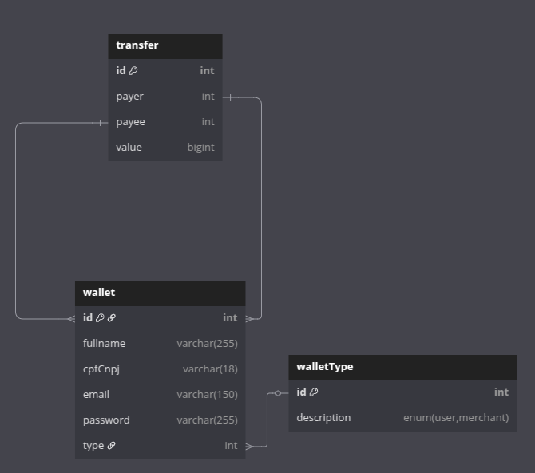

# Resposta Teste Tecnico

### Tecnologias
- PHP 8.2
- PHP Slim
- Docker
- Docker Compose
- Nginx
- MySql
- PHP Unit
- PHP Cs Fixer

### End points
- `/wallet/{id}` Exibe informações de uma carteira
- `/wallet/user` Cria uma carteira para um usuario
- `/wallet/merchant` Cria uma carteira para o Lojista
- `/transfers/{id}/cancellation` Cancelar uma transferencia e estornar a valor
- `/transfer` Cria uma transferencia

### Como executar
```bash
$ git clone && cd 
$ docker-compose up
```

### Banco de Dados


